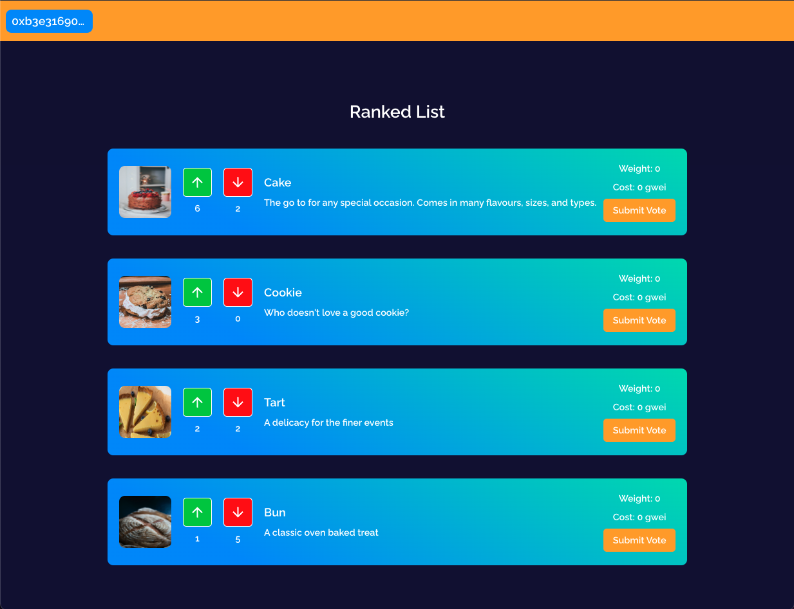

<h1>Quadratic Voting dApp</h1>

- This project is a [Quadratic Voting](https://www.economist.com/interactive/2021/12/18/quadratic-voting) proof of concept platform that allows users to submit an item to be ranked, and to cast quadratic votes in favour of or against other items. The voting price is simply the square of the weight of the vote, and the default weight value is 10 [gwei](https://www.investopedia.com/terms/g/gwei-ethereum.asp#:~:text=Key%20Takeaways-,Gwei%20is%20a%20denomination%20of%20the%20cryptocurrency%20ether%20(ETH)%2C,to%20specify%20Ethereum%20gas%20prices). Fees paid for positive votes are rewarded to the user who created the item, and fees paid for negative votes are distributed to the created of the other items, incentivising the creation of items that will be popular.
- Adapted from [this tutorial](https://learn.figment.io/tutorials/build-a-quadratic-voting-dapp) by [giraffeKey](https://github.com/giraffekey)
- Built using [NextJS](https://nextjs.org/), [Chakra UI](https://chakra-ui.com/), [Typescript](https://www.typescriptlang.org/), [Hardhat](https://hardhat.org/), [IPFS](https://ipfs.tech/), [Pinata](https://www.pinata.cloud/), [Avalanche](https://www.avax.network/), and [Solidity 0.8.17](https://docs.soliditylang.org/)
- NOTE: This project is a proof of concept, and not intended to represent a polished Web3 application. The contract used in this application has not been audited, and I take no responsiblity for issues which may arise out of its extended use.

## Screenshots

### Create Item

### Ranked List

## Deployed Contract (Avalance Fuji C-Chain SnowTrace)
[QuadraticVoting](https://testnet.snowtrace.io/address/0x6af3D87F0c37d73142765314f3773eC692996638)

## Test Coverage

